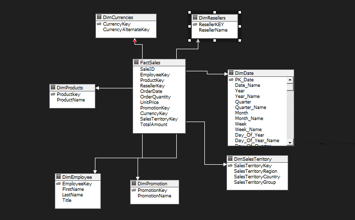
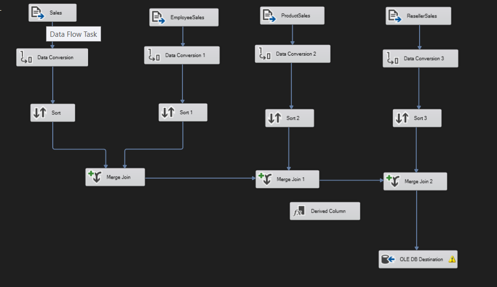

# SQL Server Data Warehouse ETL

## Overview

This project implements a complete ETL pipeline using **SQL Server Integration Services (SSIS)** to populate a SQL Server Data Warehouse from multiple CSV/flat files. The pipeline follows a classic star schema design, loading dimension tables first, then the fact table(s) that reference them.

## Technologies

- SQL Server
- SQL Server Integration Services (SSIS)
- T-SQL
- Visual Studio 2022 (SSDT)
- SQL Server Analysis Services (SSAS) — OLAP cube

## Features

- CSV / flat file extraction
- Data type conversion
- Sorting & deduplication
- Merge Join
- Lookup transformations
- Dimension table loading
- Fact table loading
- Foreign key relationships between fact and dimension tables
- OLAP cube built on top of the warehouse (SSAS)

## Star Schema



**Fact table:** `FactSales`

**Dimensions:**
- `DimDate`
- `DimEmployee`
- `DimProducts`
- `DimResellers`
- `DimPromotion`
- `DimCurrencies`
- `DimSalesTerritory`

## ETL Pipeline




## Project Structure

```
database/   # SQL scripts (schema, constraints, seed data)
ssis/       # SSIS project (.dtsx packages, connection managers)
docs/       # Documentation
images/     # Diagrams used in this README
data/       # Source CSV/flat files (not committed — see below)
```

## Prerequisites

- SQL Server (with a running instance and a database created for the warehouse)
- Visual Studio 2022 with SQL Server Integration Services projects extension installed
- Source data files placed locally (see `data/` below)

## How to Run

1. Create the database.
2. Execute the SQL scripts in `database/` to create tables, primary keys, and foreign key constraints.
3. Place the source CSV/flat files inside `/data`.
4. Open the SSIS project (`ssis/`) in Visual Studio.
5. Update the connection managers if your file paths or SQL Server instance differ from the defaults.
6. Execute `Dimensions.dtsx` first — this loads all dimension tables.
7. Execute `Fact.dtsx` — this loads the fact table(s), which depend on the dimensions being populated first.

## Cube

An SSAS cube (`MyCube`) is built on top of the warehouse, with `FactSales` as the measure group and each `Dim*` table as a dimension, including a Date dimension linked via the `FactSales` → `DimDate` foreign key.
